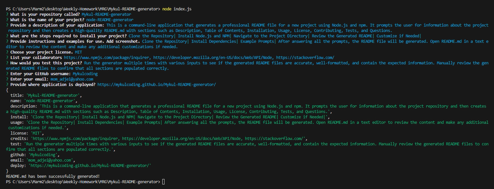

# Mykul-README-generator

## Description
This is a command-line application that generates a professional README file for a new project using Node.js and npm. It prompts the user for information about the project repository and then creates a high-quality README.md with sections such as Description, Table of Contents, Installation, Usage, License, Contributing, Tests, and Questions.

## Table of Contents

- [Installation](#installation)
- [Usage](#usage)
- [License](#license)
- [Contributing](#contributing)
- [Tests](#tests)
- [Questions](#questions)

## Installation
To install the necessary dependencies, run the following command:
[npm install]

## Usage
Instructions and examples for using a simple Node.js README generator. Where the generator prompts the user for information and generates a README based on the provided answers.

- Step 1: Clone the Repository: git clone https://github.com/your-username/node-readme-generator.git

- Step 2: Install Dependencies: npm install

- Step 3: Run the README Generator: node index.js [This command will initiate the prompts. Answer each prompt with the relevant information for your project.]

Example Prompts:
- What is your repository called? [Mykul-README-generator]

- Provide a description of your application: [This is a command-line application that generates a professional README file for a new project using Node.js and npm.]

Answer all the prompts and after the last question you'll see all your responses and a message saying "README.md has been successfully generated!" as shown in the screenshot and video below. Your README is ready to view and use via the other .md file attached. 

## License

This project is licensed under the MIT License.

## Contributing
- [Dev Community](https://dev.to/)
- [Stack Overflow](https://stackoverflow.com/)
- [MDN](https://developer.mozilla.org/en-US/)
- [NPM](https://www.npmjs.com/package/inquirer)
- [Node](https://developer.mozilla.org/en-US/docs/Web/API/Node)

## Tests
Testing a README generator project involves ensuring that the generated README file meets your expectations and provides accurate and formatted information. Since the main functionality is to generate a README file based on user input, testing would typically involve:

- Running the generator multiple times with various inputs to see if the generated README files are accurate, well-formatted, and contain the expected information. Manually review the generated README files to confirm that all sections are populated correctly.

## Questions

If you have any questions or need further assistance, please reach out:

- GitHub: https://github.com/Mykulcoding/Mykul-README-generator
- Email: mom_adjei@yahoo.com
